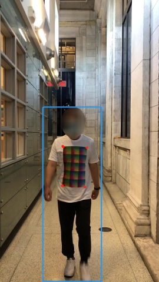
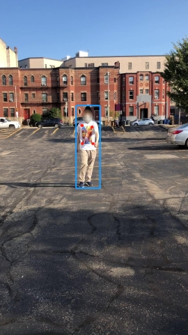
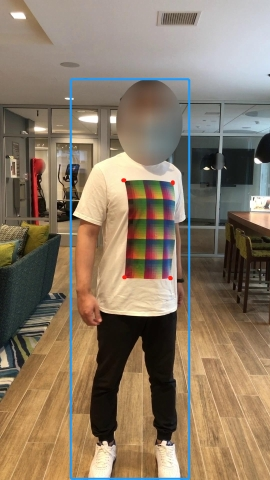

# Towards the First Standard Dataset of Adversarial Patch Attack on T-shirt against Object Detectors


## Introduction


- Multiple existing works paid attention to the adversarial patch
 generation on wearables such as: [Xu, Kaidi, et al](https://www.ecva.net/papers/eccv_2020/papers_ECCV/papers/123500647.pdf),
  [Wu, Zuxuan, et al](https://arxiv.org/pdf/1910.14667.pdf), 
  [Huang, Lifeng, et al](https://arxiv.org/pdf/1909.04326.pdf), etc. However, 1) different works empirically used different sizes of the adversarial
  patches and the size is actually a key point when conducting adversarial attacks; 
  2)different works trained on different datasets that may contain various biases.
In summary, the lack of a benchmark and a uniform dataset lead hard to draw
 a conclusion on the effectiveness of different attacking methods.

- We build this dataset to facilitate the adversarial patch attack on the person 
object by wearing a crafted T-shirt that can be printed on an adversarial pattern 
in a specific location and size. Different from traditional object detection 
datasets, like [COCO](https://cocodataset.org/#home), they provide bounding boxes 
for multiple objects that appeared in images. Our dataset only focuses on the 
**person** object in different scales and environments.

- In order to make a fair comparison, we also provide the coordinates of the person who wears the T-shirt with different patterns (but the patterns are in the same size).


## Collection Details of our Dataset

We used checkerboard and different patterns printed on T-shirts to collect 105 videos from four indoor 
and two outdoor scenes by iPhone cameras. Each video contains one, two,
or three persons walking side by side towards the camera. The data present
significant challenges such as distance, pose changes and varied illuminations. Moreover, there 8 actors 
in our dataset ranging from different heights, statures and genders. 
We uniformly sampled video frames at
a rate of 1/5, which results in 4, 892 frames. Among these frames, 2, 830 of them were used for 
training and 1, 688 for
validation.

## Quick Start
Please first download the `ori_frames` from the
 [google drive link](https://drive.google.com/file/d/1p-UmZ_TYTUughKgFbLdHjlnIkm7V9ytM/view?usp=sharing) 
 and unzip it to the root.

The structure of our dataset is shown follow:
```
adv_dataset
│   README.md
└───examples
└───ori_frames
│   └───IMG_2088
│       │   IMG_2088_0000.jpg
│       │   IMG_2088_0005.jpg
│       │   IMG_2088_0010.jpg
│       │   ...
│   
    └───IMG_2089
│       │   IMG_2089_0000.jpg
│       │   ...
│   └───...
└───pattern_coordinates
│   │   IMG_2088.json
│   │   IMG_2089.json
│   │   ...
│   train_adv_T.txt
│   test_adv_T.txt
```

We provide all original images in folder `ori_frames/`, each folder under `ori_frames/` represent a video, and 
we sampled video frames with resolution at 1920x1080.
The coordinates of the pattern located on the T-shirts are saved in  `pattern_coordinates/`, the json files 
are mappped with the videos frames in `ori_frames/`. 

For example:
 ```buildoutcfg
"IMG_2090_0000": [[501, 879], [560, 875], [502, 976], [556, 971]]
```
indicates the four (x, y) coordinates of the pattern in order of upper left, upper right, lower left 
and lower_left. 

We also help on splitting the whole dataset to two parts: training data and testing data. They are 
in `train_adv_T.txt` and `test_adv_T.txt` respectively. Moreover, the information of the bounding box of the
person who wearing the T-shirt is also in these files.

## Samples
The blue rectangle bounding box indicates the person who wearing the T-shirt with specific pattern (provided in `train_adv_T.txt` and `test_adv_T.txt`), the four red dots are the coordinates of the pettern (provided in  `pattern_coordinates/`).

    


